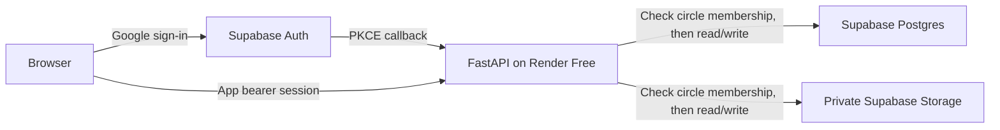

# Free hosted portfolio demo

The hosted profile keeps the current FastAPI/React application and uses **Render Free** for compute and **Supabase Free** for Google sign-in, Postgres, and private media storage. No AWS credentials or services are involved in this path. Provider setup is required before it is publicly usable.

Identity and permission are separate: Google/Supabase identify the account; the Python API checks whether that account owns, edits, or views each circle. Browsers never receive the database password or storage service key. Database tables have RLS enabled and no grants to `anon` or `authenticated`; the backend connects using the table-owning database role. Do not add browser-facing database policies for this architecture.

## 1. Supabase Free project

1. Create a project in a **Free** organization. Use a fresh project for this demo, not an unrelated application's database.
2. In Connect, copy the **session pooler** Postgres URL (IPv4 compatible, port 5432). Set a URL-encoded database password and append `?sslmode=require`. Set this as Render's `DATABASE_URL`. The runtime schema in `db/runtime_postgres.sql` is created at startup; `db/schema.sql` is a different future architecture and must not be applied here.
3. Copy the project URL and publishable key into `SUPABASE_URL` and `SUPABASE_PUBLISHABLE_KEY`.
4. Create a new server-only `sb_secret_...` key under Settings → API Keys and put it in Render as `SUPABASE_SECRET_KEY`. The backend sends it in the `apikey` header for private Storage operations. Do not use or share the legacy `service_role` key. Keep the new secret only in Render's environment settings, never in the browser, Git, screenshots, or chat.
5. Create a **private** Storage bucket named `family-media`. Set its upload size limit to **5 MiB**. Do not enable public access or add public read/write policies. The API uses its server key after checking circle membership.
6. Disable unused authentication providers if desired. This UI uses Google; it does not offer email/password registration or depend on SMTP delivery.

## 2. Google sign-in

Follow [Supabase's Google sign-in setup](https://supabase.com/docs/guides/auth/social-login/auth-google):

1. Create a Google OAuth **Web application** client and configure the consent screen with only the basic identity scopes.
2. Add `https://PROJECT.supabase.co/auth/v1/callback` to Google's authorized redirect URIs (use the callback shown in your Supabase dashboard).
3. Enable Google in Supabase Authentication → Providers and enter the Google client ID and secret there.
4. While Google's consent screen is in Testing, add your intended testers as Google test users. For unrestricted portfolio visitors, move the consent screen to the appropriate published state; follow any verification requirements Google presents.
5. Once your Render hostname is known, set Supabase's Site URL to `https://YOUR-SERVICE.onrender.com` and add the exact allowed redirect URL `https://YOUR-SERVICE.onrender.com/auth/managed/callback`. Avoid wildcard redirects.

The app starts a PKCE flow: a short-lived, HTTP-only cookie holds a random verifier; Supabase checks that verifier when the callback code is exchanged. The server then checks the returned identity with Supabase Auth. A stable Supabase user ID becomes the local account ID, so repeated logins and different devices reach the same circles.

App sessions last 14 days, are stored as hashes, and are revoked by the app's Sign Out button. Google/Supabase tokens are not saved in the browser. Existing browser behavior stores the app bearer token in localStorage. Account/provider revocation does **not** immediately revoke an already-issued app session: revoke that user's `auth_sessions` rows when removing their access. This is a small-test-cohort session design, not a complete account administration system.

## 3. Render Free service

1. Commit/push the reviewed changes to your GitHub repository, then create a Render Blueprint from `render.yaml` (or create an equivalent Docker web service manually).
2. Confirm the service is **Free**, with no disk, paid database, or paid add-on. Automatic deploys are off in the blueprint.
3. Fill the five private/configuration values prompted by Render: `DATABASE_URL`, `SUPABASE_URL`, `SUPABASE_PUBLISHABLE_KEY`, `SUPABASE_SECRET_KEY`, `PUBLIC_APP_URL`. Use the actual assigned Render HTTPS hostname for `PUBLIC_APP_URL`; update/redeploy if it differs from the initial name.
4. Leave `APP_ENV=production`, `ENABLE_REVIEW_AUTH=false`, and `POSTGRES_RUNTIME_ENABLED=true`. Startup rejects a hosted configuration with review identity enabled or SQLite persistence.
5. Deploy. The command runs **one worker**, so process-local realtime discussion broadcasts reach all connected testers. Uvicorn access logs are disabled to avoid logging OAuth callback codes and media tickets in query strings; structured app request metrics omit query strings.
6. Check `/health`: expect `db_backend: postgres`, `auth_mode: supabase`, and `review_auth_enabled: false`. No global user picker should be visible.

The example environment file is `.env.hosted.example`. The application does not automatically load `.env` files; use Render's environment settings or explicitly export variables for a shell launch.

## 4. Ten-minute real-user acceptance test

- Person A signs in with Google and clicks **Explore a sample family**. This creates five fictional people and six relationships in their own circle; clicking again reopens the same circle.
- Find **Meera Rao**, choose descendants and depth 3, then render. Open a profile, edit an occupation/story, and save it. Try adding a person and a parent relationship.
- Refresh; confirm the edit remains. Sign in to the same Google account on another device; confirm the same circle and edit.
- Upload a small image or text story. Redeploy the Render service and verify the media still opens. This specifically checks that storage is remote, not on the disposable Render filesystem.
- Person B signs in using a different Google account. They should see none of A's circles. B shares **Your invitation code**; A pastes it into **Invitations & Ownership**, chooses viewer, and sends the invitation. B accepts. B can view but cannot edit. Test editor separately if collaboration is in scope.
- Sign out; a previously issued media ticket should no longer open the private file.
- Note where testers hesitate: getting started, finding a person, understanding graph direction, editing a profile, and accepting an invitation. Use fictional information during usability sessions.

Live Google sign-in, a real Supabase database/storage project, and Render deployment must be verified with your configured accounts. Local tests use a fake provider and a temporary SQLite database; they cannot certify provider dashboard settings or deployed cross-device behavior.

## Free-tier limits and data lifetime

Verified against provider documentation on 2026-09-18; recheck before deployment:

- [Render Free](https://render.com/docs/free): free compute sleeps after 15 minutes without traffic, has a monthly hours allowance, and has no persistent local disk. The first visitor may wait for startup. Do not use Render's time-limited free Postgres for long-term records.
- [Supabase pricing](https://supabase.com/pricing): Free includes 500 MB database storage, 1 GB file storage, 50,000 monthly active users, and limited egress. Projects may pause after a week of inactivity. This is suitable for a small portfolio cohort, not a promise of uninterrupted hosting or archival retention.
- Stay on Free plans, do not attach paid upgrades or AWS resources, and monitor usage in the dashboards. Free limits can cause service restriction rather than provide unlimited capacity. Keep off-platform backups of records you care about; free service is not a backup policy.
- Media uploads are capped at 5 MiB by this deployment. Total storage and egress still need monitoring; a per-file limit is not a total quota.
- Existing AWS resources can continue charging even if this demo moves. The AWS workflows are manually triggered already. This change neither inspects nor deletes your running AWS resources. Review any EC2, EBS, ECR, load balancers, and related resources separately before retiring them.

## Existing data and rollback

This profile starts with a new hosted database. It does not silently migrate existing local/AWS data or adopt unverified review users as real accounts. Review IDs must never be linked by display-name matching. For valuable existing data, plan an explicit export/import and verified ownership mapping first.

To return to local review testing, unset all Supabase variables, use a local SQLite `DB_PATH`, and set `APP_ENV=development`. Sessions remember their `auth_source`; review sessions cannot unlock the hosted deployment and hosted sessions cannot unlock review mode. Do not enable the identity picker on a public host.

## Verification for this change

- Full local suite: **76 backend tests passed, 10 Postgres tests skipped; 16 frontend tests passed**.
- Hosted-boundary tests use temporary SQLite plus a mocked provider: PKCE exchange/handoff, rejected callbacks, account isolation, review-session rejection, logout, remote-media behavior, safe secret-key headers, and saved edits across separate sessions for the same identity.
- In-app browser with a disposable mocked-identity server: sign-in gate, account handoff, private sample creation, graph rendering, profile edit/save, reload, and reopening the saved edit all passed; no browser error logs in that flow.
- Live Google/Supabase/Render, real Postgres/RLS execution, real remote media storage, and physical cross-device checks remain unverified. Local Docker was not running, so the opt-in Postgres suite could not run.
