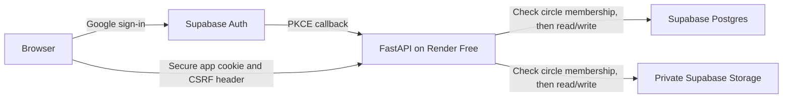

# Free hosted portfolio demo

The hosted profile keeps the current FastAPI/React application and uses **Render Free** for compute and **Supabase Free** for Google sign-in, Postgres, and private media storage. No AWS credentials or services are involved in this path. Provider setup is required before it is publicly usable.

```mermaid
flowchart LR
    Browser -->|Google sign-in| Auth[Supabase Auth]
    Auth -->|PKCE callback| API[FastAPI on Render Free]
    Browser -->|Secure app cookie and CSRF header| API
    API -->|Check circle membership, then read/write| DB[Supabase Postgres]
    API -->|Check circle membership, then read/write| Storage[Private Supabase Storage]
```

Identity, demo admission, and family permission are separate: Google/Supabase identify the account; `APPROVED_TESTER_EMAILS` admits a small cohort; the Python API checks whether that account owns, edits, or views each circle. Browsers never receive the database password or storage service key. Database tables have RLS enabled and no grants to `anon` or `authenticated`; the backend connects using the table-owning database role. Do not add browser-facing database policies for this architecture.

## 1. Supabase Free project

1. Create a project in a **Free** organization. Use a fresh project for this demo, not an unrelated application's database.
2. In Connect, copy the **session pooler** Postgres URL (IPv4 compatible, port 5432). Set a URL-encoded database password and append `?sslmode=require`. Set this as Render's `DATABASE_URL`. The runtime schema in `db/runtime_postgres.sql` is created at startup; `db/schema.sql` is a different future architecture and must not be applied here.
3. Copy the project URL and publishable key into `SUPABASE_URL` and `SUPABASE_PUBLISHABLE_KEY`.
4. Create a new server-only `sb_secret_...` key under Settings → API Keys and put it in Render as `SUPABASE_SECRET_KEY`. The backend sends it in the `apikey` header for private Storage operations. Do not use or share the legacy `service_role` key. Keep the new secret only in Render's environment settings, never in the browser, Git, screenshots, or chat.
5. Create a **private** Storage bucket named `family-media`. Set its upload size limit to **5 MiB** and restrict MIME types to `image/jpeg,image/png`. Do not enable public access or add public read/write policies. The hosted API accepts only JPEG and PNG images after checking circle membership.
6. Disable unused authentication providers if desired. This UI uses Google; it does not offer email/password registration or depend on SMTP delivery.

## 2. Google sign-in

Follow [Supabase's Google sign-in setup](https://supabase.com/docs/guides/auth/social-login/auth-google):

1. Create a Google OAuth **Web application** client and configure the consent screen with only the basic identity scopes.
2. Add `https://PROJECT.supabase.co/auth/v1/callback` to Google's authorized redirect URIs (use the callback shown in your Supabase dashboard).
3. Enable Google in Supabase Authentication → Providers and enter the Google client ID and secret there.
4. Keep Google's consent screen in **Testing** for this approved-tester demo and add each intended tester as a Google test user. Also put each verified Google email address in Render's `APPROVED_TESTER_EMAILS` (step 3 below). Both gates are required: a Google test-user setting alone is not an app-level access rule. The public portfolio walkthrough does not require app sign-in. If open sign-up is considered later, revisit Google publishing, abuse controls, and capacity before changing access.
5. Once your Render hostname is known, set Supabase's Site URL to `https://YOUR-SERVICE.onrender.com` and add the exact allowed redirect URL `https://YOUR-SERVICE.onrender.com/auth/managed/callback`. Avoid wildcard redirects.

The app starts a PKCE flow: a short-lived, HTTP-only cookie holds a random verifier; Supabase checks that verifier when the callback code is exchanged. The server then checks the returned identity with Supabase Auth. A stable Supabase user ID becomes the local account ID, so repeated logins and different devices reach the same circles.

App sessions last 14 days, are stored as hashes, and are revoked by the app's Sign Out button. The V3 hosted browser uses a `Secure`, `HttpOnly`, `SameSite=Lax` cookie; state-changing requests require a CSRF header. Google/Supabase tokens are not saved in the browser. Existing V2 sessions without a recorded verified email are denied until Google re-login; that first V3 login revokes their old app sessions. A legacy bearer can migrate only if it already belongs to an approved account. Removing an email from `APPROVED_TESTER_EMAILS` blocks its app sessions and tickets after Render restarts; account/provider revocation alone is not continuously checked. For permanent removal, also use the account-wide sign-out action or `scripts/revoke_hosted_sessions.py` to revoke all app sessions.

## 3. Render Free service

1. Commit/push the reviewed changes to your GitHub repository, then create a Render Blueprint from `render.yaml` (or create an equivalent Docker web service manually).
2. Confirm the service is **Free**, with no disk, paid database, or paid add-on. Automatic deploys are off in the blueprint.
3. Fill the six private/configuration values prompted by Render: `DATABASE_URL`, `SUPABASE_URL`, `SUPABASE_PUBLISHABLE_KEY`, `SUPABASE_SECRET_KEY`, `PUBLIC_APP_URL`, and `APPROVED_TESTER_EMAILS`. Use the actual assigned Render HTTPS hostname for `PUBLIC_APP_URL`; update/redeploy if it differs from the initial name. Set `APPROVED_TESTER_EMAILS` to a comma-separated list of exact verified Google addresses, such as `owner@example.com,tester@example.com`. Do not put real addresses in Git. Add or remove testers in Render's environment settings and restart/redeploy for the change to take effect. Hosted startup fails closed if the list is empty.
4. Leave `APP_ENV=production`, `ENABLE_REVIEW_AUTH=false`, and `POSTGRES_RUNTIME_ENABLED=true`. Startup rejects a hosted configuration with review identity enabled or SQLite persistence.
5. Before deploying V3, test its additive schema migration (including `approved_accounts`, invitation lifecycle fields, request counters, and media quota fields) against a disposable Supabase Postgres project. **Do not run the repository's Postgres test suite against Supabase:** it resets `public` and is guarded to the bundled disposable local database at `127.0.0.1:5433/family_tree`. That local suite can be run with `make postgres-up` and `make test-postgres` after Docker is available. For a Supabase rehearsal, use a newly created throwaway project and an additive migration/smoke check without dropping its schema. Then deploy a controlled release. The command runs **one worker**, so process-local realtime discussion broadcasts reach all connected testers. Uvicorn access logs are disabled to avoid logging OAuth callback codes and media tickets in query strings; structured app request metrics omit query strings.
6. Check `/health`: expect `db_backend: postgres`, `auth_mode: supabase`, and `review_auth_enabled: false`. No global user picker should be visible.

The example environment file is `.env.hosted.example`. The application does not automatically load `.env` files; use Render's environment settings or explicitly export variables for a shell launch.

## 4. Ten-minute real-user acceptance test

- Confirm an unlisted Google account cannot obtain an app session; add Person A and B to both Google's test users and `APPROVED_TESTER_EMAILS`. Existing V2 testers need to sign in again so V3 records their verified email.
- Person A signs in with Google and clicks **Explore a sample family**. This creates five fictional people and six relationships in their own circle; clicking again reopens the same circle.
- Find **Meera Rao**, choose descendants and depth 3, then render. Open a profile, edit an occupation/story, and save it. Try adding a person and a parent relationship.
- Refresh; confirm the edit remains. Sign in to the same Google account on another device; confirm the same circle and edit.
- Upload a small JPEG or PNG image. Redeploy the Render service and verify the media still opens. This specifically checks that storage is remote, not on the disposable Render filesystem.
- Person B signs in using a different Google account. They should see none of A's circles. B shares **Your invitation code**; A pastes it into **Invitations & Ownership**, chooses viewer, and sends the invitation. B accepts. B can view but cannot edit. Test editor separately if collaboration is in scope.
- Sign out; a previously issued media ticket should no longer open the private file. Revoke all sessions and confirm a second device loses access. Remove a test address from the app allowlist, restart, and confirm its existing session and ticket fail.
- Note where testers hesitate: getting started, finding a person, understanding graph direction, editing a profile, and accepting an invitation. Use fictional information during usability sessions.

On 2026-09-20, the project owner manually reported successful live Google sign-in for two accounts, a private sample circle, a profile edit visible on a phone, a JPEG/PNG upload stored in Supabase and reopened after a Render redeploy, account isolation, an accepted viewer invitation, and read-only viewer fields with medical-note redaction. This is manual user-reported acceptance; local tests use a fake provider and temporary SQLite database and do not independently certify provider configuration or all deployed permission paths.

## Free-tier limits and data lifetime

Verified against provider documentation on 2026-09-18; recheck before deployment:

- [Render Free](https://render.com/docs/free): free compute sleeps after 15 minutes without traffic, has a monthly hours allowance, and has no persistent local disk. The first visitor may wait for startup. Do not use Render's time-limited free Postgres for long-term records.
- [Supabase pricing](https://supabase.com/pricing): Free includes 500 MB database storage, 1 GB file storage, 50,000 monthly active users, and limited egress. Projects may pause after a week of inactivity. This is suitable for a small portfolio cohort, not a promise of uninterrupted hosting or archival retention.
- Stay on Free plans, do not attach paid upgrades or AWS resources, and monitor usage in the dashboards. Free limits can cause service restriction rather than provide unlimited capacity. Keep off-platform backups of records you care about; free service is not a backup policy.
- Media uploads are capped at 5 MiB per file, 100 MiB per uploader, and 250 MiB per circle by V3 application checks. Shared database counters also limit repeated uploads, invitations, and heavy reads. Provider egress and database usage still need monitoring; these are application limits, not a guarantee against all abuse.
- Existing AWS resources can continue charging even if this demo moves. The AWS workflows are manually triggered already. This change neither inspects nor deletes your running AWS resources. Review any EC2, EBS, ECR, load balancers, and related resources separately before retiring them.

## Existing data and rollback

This profile starts with a new hosted database. It does not silently migrate existing local/AWS data or adopt unverified review users as real accounts. Review IDs must never be linked by display-name matching. For valuable existing data, plan an explicit export/import and verified ownership mapping first.

To return to local review testing, unset all Supabase variables, use a local SQLite `DB_PATH`, and set `APP_ENV=development`. Sessions remember their `auth_source`; review sessions cannot unlock the hosted deployment and hosted sessions cannot unlock review mode. Do not enable the identity picker on a public host.

For a hosted rollback, keep the last verified V2 image/commit available and take a database backup first. The V3 schema changes are additive, but V3-issued cookie sessions are not readable by the older V2 frontend. A rollback can require testers to sign in again. Do not drop new tables or columns just to revert application code; preserve account and archive data. Record a fictional two-account smoke test before and after any release.

## Verification history and V3 release evidence

- The original hosted profile passed **76 backend tests**, with **10 Postgres tests skipped**, plus **16 frontend tests**. Those numbers describe V2; see [the V3 implementation report](security-implementation-report.md) for current local results and user-reported hosted checks.
- Hosted-boundary tests use temporary SQLite plus a mocked provider: PKCE exchange/handoff, rejected callbacks, account isolation, review-session rejection, logout, remote-media behavior, safe secret-key headers, and saved edits across separate sessions for the same identity.
- In-app browser with a disposable mocked-identity server: sign-in gate, account handoff, private sample creation, graph rendering, profile edit/save, reload, and reopening the saved edit all passed; no browser error logs in that flow.
- The owner reported live Google/Supabase/Render and cross-device checks above for V2. V3's disposable local PostgreSQL suite passes, including its additive migration and Supabase-style table privacy checks. On 2026-10-07, the owner additionally reported approved viewer sign-in after correcting Render's allowlist, viewer read-only fields, the medical-note privacy notice, cross-browser sign-out on all devices, and a previously opened private image link returning `{"detail":"Missing or invalid media access ticket"}` after sign-out. These are user-reported hosted observations; they do not independently verify all provider settings, rate/storage limits, or a complete Supabase restore.
