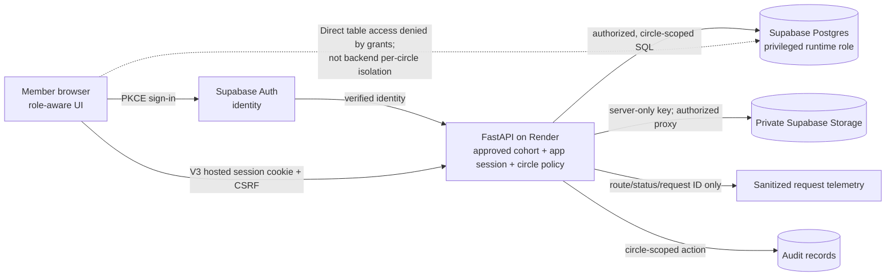

# Viraasat V3 security case-study source

**Publication status:** Draft source, not public copy. V3 passes local synthetic and disposable PostgreSQL tests and is deployed to a small approved-tester cohort. The owner has reported hosted login, viewer privacy, cross-browser revocation, and media-ticket denial checks; [the implementation report](security-implementation-report.md) separates these observations from unverified controls. Use only sanitized synthetic screenshots when adapting this to the portfolio.

## Product context and problem

Viraasat is a private, collaborative family archive for stories, relationships, places, and photos. These records are meaningful because families can contribute together; that same collaboration makes accidental sharing and role mistakes consequential. Medical notes are especially sensitive and require a narrower view than an ordinary profile.

The central challenge is that **authentication does not imply authorization**. Google/Supabase can identify a person, but Viraasat must still decide whether that person belongs to a particular family circle and whether they may view, edit, invite, or see a sensitive field. A disabled button helps someone understand their role; only a server check protects the record when the request is changed manually.

## Threats that shaped the work

1. A valid but unapproved Google account enters the demo, or a signed-in user substitutes another circle or nested resource ID to see a different family's records.
2. A viewer sends editor/owner requests directly, or reads medical notes through a history/audit payload.
3. An image path, media ticket, or long-lived session is copied and used after access should end.
4. Invitations are replayed, accepted by a different account, or left open indefinitely.
5. Upload and read bursts consume a free hosting quota; logs or screenshots disclose the data they are supposed to help protect.

The complete [threat model](security-threat-model.md) pairs these abuse cases with controls, tests, and remaining limits.

## Key decisions: problem → decision → trade-off → evidence

| Problem | Decision | Trade-off | Evidence status |
|---|---|---|---|
| Google identifies more people than the small approved demo should admit | Require a server-side verified-email cohort; recheck each app session/ticket and revoke pre-approval sessions on first V3 login | The owner manages a Render allowlist; existing testers must re-login | Denied callback, deapproval, and first-login legacy-session tests pass locally; owner reported hosted rejection before correcting a mismatched Render email. |
| A valid login can name a foreign circle or claim a stronger role | FastAPI checks membership and required role; V3 defines named, fail-closed actions and revalidates active WebSockets | A missed route could undermine the boundary | Fictional two-family ID/role and live-connection revocation tests pass locally; owner observed viewer read-only UI and medical-note notice. No direct hosted forged-request probe. |
| Viewer-facing secondary payloads can reveal private medical notes | Redact sensitive fields in person, revision, change-request, and audit serializers | Circle-wide roles are coarse; consent is not represented | `app/api/privacy.py` and viewer regression tests pass locally. |
| Private image URLs could become durable capabilities | Keep the bucket private and proxy reads after API authorization; scope and bind short-lived media tickets to a revocable app session | More Render bandwidth and latency than direct signed URLs | Existing ticket scope/expiry/revocation tests; owner observed a copied image link fail after sign-out. Provider configuration is not independently certified. |
| A stolen session may outlive an account decision | Hash stored tokens; V3 moves hosted sessions to `HttpOnly`/`Secure`/`SameSite` cookies with CSRF checks and adds account-wide app-session revocation | Cookies are automatically sent, so the CSRF check becomes essential; compromised same-origin code can still act as the user | Cookie, CSRF, migration rotation, and revoke-all tests pass locally; owner observed Safari and Incognito Chrome both lose access after revoke-all. |
| Invitation and request bursts can create durable access or consume free resources | Bind invitations to account IDs; V3 adds expiry/revocation/replay safety and durable abuse limits | Legitimate requests may be delayed; shared-state checks add database work | Invitation lifecycle, API quota, and 429 tests pass locally; concurrent Postgres check pending. |
| RLS is enabled, but the backend uses a table-owning role | State that API policy is the per-circle boundary; require a non-bypassing runtime role and real Postgres tests before claiming per-circle RLS | This defers database defense in depth and requires stronger API coverage | `db/supabase_privacy.sql` and runtime connection inspected. Per-circle RLS **not implemented or verified**. |
| Operational evidence can expose the archive | Log request ID, route template, outcome/status, and timing without URLs, bodies, headers, or family content; 401/403/429 appear in bounded metrics | Less raw debugging detail; process-local counters cannot describe the whole fleet or alert on incidents | Route-template/redaction tests pass locally; production aggregation is not implemented. |

The [decision records](security-decisions.md) contain the alternatives and residual risks behind each choice. In particular, this implementation uses an API media proxy, **not** Supabase signed URLs. It does not claim per-circle Postgres RLS.

## Defense-in-depth and trust boundaries

The trust boundary is at FastAPI: the browser cannot claim its own role, and the API must not pass through a storage key or an unrestricted database connection. The RLS/grant line stops direct browser table access; it is not evidence of a second family-isolation decision by the database. [SEC-004](security-decisions.md#sec-004--treat-database-rls-as-a-separate-design-gate) explains the role change that would be needed.

## Verification and what each test proves

The local suite ran `RUN_POSTGRES_TESTS=true .venv/bin/pytest -q` (**112 passed, including 12 disposable PostgreSQL tests**) and the five-file Node frontend suite (**16 passed**) with fictional families and owner, editor, viewer, and outsider identities. These results describe repository code; the [implementation report](security-implementation-report.md) records hosted observations and remaining evidence gaps. The regression set covers:

- **Foreign ID substitution:** User A's valid session requests Family B's circle, person, list, history, audit, media, and WebSocket data. A denial with no Family B payload proves object authorization is checked after identity verification.
- **Role inversion:** A viewer tries to create/edit/link/delete, invite, transfer ownership, or see medical notes. A denied request and unchanged database prove that the UI is not the only role control.
- **Invalid and expired sessions:** Missing, revoked, wrong-auth-source, and expired tokens fail. Hosted cookie/CSRF tests reject forged state-changing requests; account-wide revocation disables app sessions and derived tickets in local tests.
- **Approved cohort:** An unlisted verified Google account gets no app session. Removing an email blocks an existing session and child ticket; the first approved V3 login revokes its pre-approval V2 sessions.
- **Private media:** A user without membership cannot obtain or use a media ticket; a ticket for another circle/scope or revoked parent session fails. Unsafe/oversized or over-quota uploads fail and leave no orphaned object.
- **Invitation lifecycle:** Wrong-recipient, expired, revoked, and repeated acceptance fail without granting or inflating a role. Concurrent Postgres acceptance remains untested.
- **Log redaction:** Synthetic secrets inserted into test requests do not appear in captured request logs; route templates and request IDs still provide troubleshooting context.

SQLite-backed API tests demonstrate application behavior. A different, non-owning Postgres role and real policy tests are needed for per-circle RLS claims. User-reported Render/Supabase smoke checks describe only the flows actually tried; do not substitute them for a provider/configuration audit.

## Remaining limits

Viraasat cannot stop an authorized relative from saving or sharing a story or photo outside the app. The V3 `HttpOnly` cookie reduces browser token exposure, but compromised same-origin code can still act through the browser. Pre-approval V2 sessions require re-login; an already-approved legacy session can rotate into the cookie. Upstream Google account revocation is not a continuous check. The free-tier deployment has limited capacity, process-local telemetry, no advanced anomaly detection, and no verified independent backup/restore policy for real family records. The present role model does not encode each living person's consent, correction, export, or deletion preferences. Keep sign-in limited to approved testers and use only fictional data in security tests and portfolio evidence while these product and operational decisions remain open.
