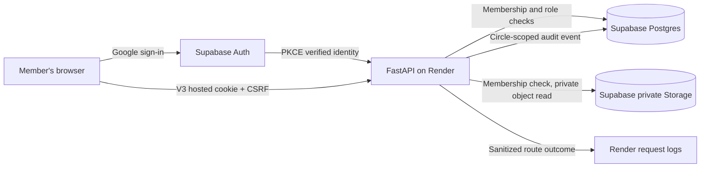

# Viraasat V3 threat model

**Scope:** A small, approved-test cohort uses a Render-hosted FastAPI application with Supabase Auth, Postgres, and private Storage. Viraasat holds family stories, relationships, dates, places, medical notes, and photos. This is a product-risk model, not a claim that the hosted service has passed an independent security review. Likelihood is a qualitative judgment about reachable actions, not a measured attack frequency. The table preserves the starting V3 risk assessment; current user-reported hosted checks and remaining evidence gaps are recorded in the [implementation report](security-implementation-report.md), alongside [security decisions](security-decisions.md) and the [route matrix](security-route-matrix.md).

## Boundaries and assumptions

- Supabase Auth establishes the account identity. A configured verified-email allowlist decides admission to the small tester cohort. A fourteen-day app session represents that identity to FastAPI. Authentication and admission do not themselves grant access to any family circle.
- FastAPI is the current per-circle authorization boundary. The Postgres runtime connection uses a privileged table-owning role; the existing RLS/grant script removes direct browser access but is not a second per-circle check for the API.
- The Storage bucket is private. The API reads objects using a server-only secret after membership checks and proxies bytes to the member. Viraasat does not currently issue Supabase signed URLs.
- A circle owner can invite a specific account as editor or viewer; owner/editor/viewer is circle-wide, while medical notes are restricted to owner/editor. These roles do not represent consent of every person in the archive.

## Abuse cases and evidence needed

| Threat | Likelihood / impact | Current or chosen control | Verification | Residual risk |
|---|---|---|---|---|
| Unapproved Google account or revived pre-V3 session | Medium / high: Google identity alone should not open a private demo | Hosted callback checks `APPROVED_TESTER_EMAILS`; sessions and tickets recheck approval; first approved login revokes pre-approval sessions | Mocked-provider callback denial, deapproval, configuration, and old-session tests pass locally. Owner observed hosted allowlist denial and corrected viewer sign-in; active-account deapproval was not tried live. | List changes require a restart; permanently removing a tester also requires revoking all app sessions. |
| Cross-family data access by changing `circle_id` or a nested resource ID | Medium / high: UUIDs are hard to guess but requests can be edited or IDs leaked | Existing API membership checks and circle-constrained SQL; V3 named-action route policy and two-family matrix | Synthetic owner/editor/viewer/outsider substitution and realtime revocation tests pass locally. [Route inventory](security-route-matrix.md) is broader than the individually tested routes; direct hosted ID substitution was not tried. | A missed route check remains dangerous because the runtime database role is privileged. |
| Viewer privilege escalation or owner-only operation by a lower role | Medium / high: a viewer can send raw requests despite disabled UI | Named-action server policy and medical-note redaction | Synthetic cross-role route and redaction tests pass locally; owner observed read-only viewer UI and medical-note privacy notice. Direct hosted forged-request probe remains unperformed. | Compromised owner accounts retain full circle control. |
| Resource enumeration and scraping | Medium / medium-high: authenticated readers can automate list and graph reads | Circle membership gate and durable heavy-read limiter | Synthetic graph/read limit and foreign-ID tests pass locally; restart/concurrent Postgres proof pending. | Authorized readers can still export or photograph what they legitimately see; distributed abuse may exceed app-level limits. |
| Private-media path or ticket misuse | Medium / high: image content may be sensitive | Private bucket; membership-checked API proxy; scoped, hashed media ticket bound to active app session; JPEG/PNG hosted restriction | Wrong circle/asset, no session, wrong scope, expired ticket, logout, and revoked membership tests pass locally. Owner observed a copied hosted image link fail after sign-out; bucket configuration was not independently audited. | Authorized users can retain copies; API proxy consumes server bandwidth. |
| Stolen, expired, or provider-revoked session | Medium / high: V2 localStorage bearer token is readable to injected JavaScript | High-entropy hashed-at-rest session, fourteen-day expiry, logout revocation, CSP; V3 hosted `HttpOnly`/`Secure`/`SameSite` cookie, CSRF guard, and account-wide app-session revocation | Invalid/expired/revoked tokens, cookie flags, missing/invalid CSRF, revoke-all, and child-ticket invalidation pass local tests. Owner observed Safari and Incognito Chrome sessions lose access after revoke-all; hosted cookie flags/CSRF rejection were not directly inspected. | Provider revocation is not automatically synchronized; a compromised same-origin browser can still make requests until the app session is revoked. |
| Invitation replay, wrong-recipient acceptance, or unbounded pending invites | Medium / medium-high: membership is a durable grant | Owner-only creation, target account ID check, seven-day expiry, revocation, atomic replay, and throttle | Wrong-account, expired, revoked, repeated, role-floor, and owner-only route tests pass locally; concurrent Postgres proof pending. | A legitimate owner can intentionally invite the wrong person; invitee account compromise is outside this check. |
| Accidental destructive edits or ownership transfer | Medium / high for valuable family records | Audit/revisions exist for parts of the model; a relationship delete and ownership transfer are possible | Synthetic recovery drill: perform destructive action, inspect audit/revisions, restore from tested backup or document inability. **Restore/retention proof pending.** | Free-tier database/storage and audit are not independent backups; deleted or overwritten content may not be recoverable. |
| Malicious or oversized upload | Medium / medium-high: uploaded bytes come from users | Per-file size cap, type signature sniffing, safe server filenames, hosted JPEG/PNG-only rule, private bucket; V3 aggregate circle/uploader quotas | Existing signature/size and new API over-quota tests pass locally; concurrent Postgres/storage cleanup proof pending. | File signatures do not prove that image decoders have no vulnerabilities. Authorized uploads can consume storage/egress. |
| Leaked database or Storage key | Low-medium / critical: server-only secrets could expose all families if disclosed | Render environment variables, no browser key exposure, provider responses are not relayed; restricted public DB roles | Search built assets, repository, logs, screenshots for secret patterns; rotate a test key and verify old key fails. **Deployment-level evidence pending.** | Render/Supabase operator accounts and access to their dashboards remain high-trust. |
| Sensitive values in logs or screenshots | Medium / high: callback URLs, media tickets, stories, and notes can appear in common debugging output | Uvicorn access log disabled; app logs route templates, request IDs, status/timing without body/query/header; viewer-facing history/audit redacts medical notes | Feed synthetic secret strings via path/query/body; capture logs and assert absence; review each portfolio asset before publishing. Existing observability tests cover raw query exclusion; final integrated check pending. | Provider/edge logs have independent retention/access settings; a manual screenshot can still expose private data. |
| Login, invite, and read abuse against free hosting | Medium / medium: tiny hosting quota can be exhausted without a large attack | V3 durable rate and storage limits plus per-file cap | Local helper and API tests prove 429 and no duplicate invitation; restart/concurrent Postgres proof pending. | Distributed attack or provider-level egress may exceed application controls; no advanced anomaly alerting yet. |

## Release and privacy boundaries

Since the starting assessment, the working tree added the verified-email tester gate, named circle actions, two-family and WebSocket revocation tests, hosted cookie/CSRF tests, account-wide revocation, seven-day invitation lifecycle, durable request caps, and aggregate media quotas. These pass local synthetic tests. Real Postgres, Supabase, and Render behavior remains unverified, and no living-person consent or independent restore drill has been completed.

Keep approved-test access until open sign-up, consent, data export/deletion, restore, and operational capacity are separately designed. Do not use real family stories or media for adversarial tests or portfolio screenshots. An API test on temporary SQLite proves route logic; it does not prove Postgres RLS, Supabase Storage settings, or the deployed Render configuration.
